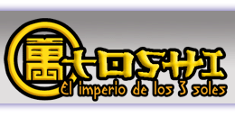

# Toshi - El imperio de los tres soles

Proyecto de fin de master realizado para el Master de Videojuegos de la Universidad Complutense de Madrid por el grupo 
MDV Studios compuesto por:

* Carlos Pardo de Santayana Navarro 

* Jorge Rufo del Pozo 

* Pablo Javier García Mora 

El proyecto está desarrollado en C++ y TCL, y utiliza el motor gráfico Nebula 2

